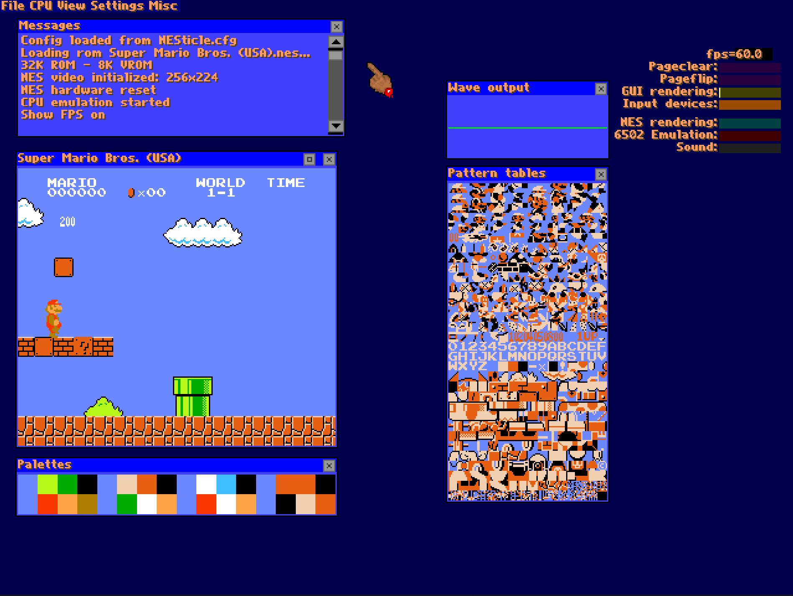

# NESticle (Modernized)

NESticle v0.2 (Bloodlust Software, 1997) ported to modern Windows via SDL2.

## Changes from Original

| Component | Original | Replacement |
|---|---|---|
| Compiler | Borland C++ / Watcom | MSVC 2022 |
| Platform | DOS / Win95 DirectDraw+DirectSound | SDL2 |
| 6502 CPU | x86 ASM core | fake6502 (public domain) |
| Rendering | x86 ASM blitters | C |
| Audio | 3-channel linear mixer | 5-channel NES DAC formulas |
| Input | Win95 keyboard | SDL2 keyboard + GameController |

## Controls

| Input | Action |
|---|---|
| Arrows | D-pad |
| Z / X | B / A |
| Tab / Enter | Select / Start |
| ALT+ENTER | Fullscreen |
| Gamepad | Works automatically, remappable in Settings |

## Running

Unzip and run `NESticle.exe`. Requires `gui.vol`, `nes.pal`, and `SDL2.dll` in the same directory (included in release).

## Known Issues

- APU sound is the original NESticle core — not cycle-accurate
- ~8 mappers supported (MMC 0-7)

## License

NESticle is (c) Bloodlust Software / Icer Addis. This is a restoration made in good faith. If the original author objects, this repository will be taken down.

- fake6502: public domain
- SDL2: zlib license
